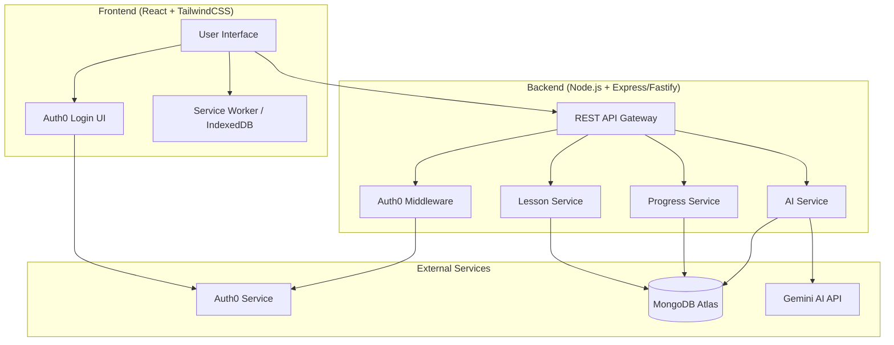

# Design Document

## Overview

RuralLearn MVP is a full-stack web application designed to deliver personalized education to rural students with limited connectivity. The architecture follows a client-server model with React frontend, Node.js backend, Auth0 for authentication, MongoDB for data persistence, and Gemini AI for personalization features.

The system prioritizes offline-first design, lightweight performance for low-spec devices, and seamless integration of AI-powered learning recommendations.

## Architecture

### High-Level Architecture



### Technology Stack

**Frontend:**
- React 18+ with functional components and hooks
- TailwindCSS for styling
- React Router for navigation
- Auth0 React SDK for authentication
- Axios for API calls
- Service Worker + IndexedDB for offline caching (optional)

**Backend:**
- Node.js with Express or Fastify
- Auth0 Node SDK for token verification
- Mongoose for MongoDB ODM
- Google Generative AI SDK for Gemini integration
- CORS middleware for cross-origin requests

**Database:**
- MongoDB Atlas (cloud-hosted)

**Authentication:**
- Auth0 (OAuth 2.0 / OpenID Connect)

**AI:**
- Google Gemini API

## Components and Interfaces

### Frontend Components

#### 1. Authentication Components

**LoginPage Component**
- Renders Auth0 Universal Login UI
- Handles authentication callback
- Redirects to dashboard on success

**ProtectedRoute Component**
- Wraps authenticated routes
- Checks Auth0 token validity
- Redirects to login if unauthenticated

#### 2. Dashboard Component

**DashboardPage Component**
- Displays user profile (name, role, avatar)
- Shows learning progress metrics (lessons completed, quiz scores, time spent)
- Provides navigation to lessons
- Displays AI-generated recommendations

**ProgressCard Component**
- Visualizes progress for individual lessons or topics
- Shows completion percentage and quiz scores

#### 3. Lesson Viewer Components

**LessonPage Component**
- Fetches and displays lesson content
- Renders text content with formatting
- Embeds video player for video lessons
- Triggers quiz display after lesson completion

**VideoPlayer Component**
- Embeds video with controls
- Tracks watch progress
- Supports multiple video formats

**QuizComponent**
- Displays quiz questions one at a time or all together
- Handles answer submission
- Shows results with correct answers and explanations
- Updates progress on completion

#### 4. AI Features Components

**RecommendationPanel Component**
- Displays personalized lesson recommendations from Gemini AI
- Shows reasoning for recommendations
- Allows navigation to recommended lessons

**ChatbotWidget Component** (optional)
- Floating chat interface
- Sends user messages to Gemini AI
- Displays AI responses in real-time
- Maintains conversation history

### Backend API Endpoints

#### Authentication Endpoints

```
POST /api/auth/callback
- Verifies Auth0 token
- Creates or retrieves user from MongoDB
- Returns user data and session token
```

#### User Endpoints

```
GET /api/users/me
- Returns authenticated user profile
- Requires Auth0 token

PUT /api/users/me
- Updates user profile
- Requires Auth0 token
```

#### Lesson Endpoints

```
GET /api/lessons
- Returns list of available lessons
- Supports filtering and pagination
- Requires authentication

GET /api/lessons/:id
- Returns specific lesson content
- Includes text, video URL, and quiz data
- Requires authentication
```

#### Progress Endpoints

```
GET /api/progress
- Returns user's learning progress
- Includes completed lessons and quiz scores
- Requires authentication

POST /api/progress/lesson/:id
- Records lesson completion
- Updates progress in MongoDB
- Requires authentication

POST /api/progress/quiz/:id
- Submits quiz answers
- Calculates score
- Stores results in MongoDB
- Returns score and correct answers
- Requires authentication
```

#### AI Endpoints

```
POST /api/ai/recommendations
- Sends user progress to Gemini AI
- Returns personalized lesson recommendations
- Requires authentication

POST /api/ai/chat
- Sends user message to Gemini AI
- Returns AI response
- Maintains conversation context
- Requires authentication
```

## Data Models

### User Model

```javascript
{
  _id: ObjectId,
  auth0Id: String (unique, required),
  email: String (required),
  name: String (required),
  role: String (enum: ['student', 'mentor'], required),
  avatar: String (URL),
  createdAt: Date,
  updatedAt: Date
}
```

### Lesson Model

```javascript
{
  _id: ObjectId,
  title: String (required),
  description: String,
  content: {
    type: String (enum: ['text', 'video', 'mixed']),
    text: String,
    videoUrl: String
  },
  quiz: {
    questions: [{
      question: String (required),
      options: [String] (required),
      correctAnswer: Number (required),
      explanation: String
    }]
  },
  difficulty: String (enum: ['beginner', 'intermediate', 'advanced']),
  tags: [String],
  createdAt: Date,
  updatedAt: Date
}
```

### Progress Model

```javascript
{
  _id: ObjectId,
  userId: ObjectId (ref: 'User', required),
  lessonId: ObjectId (ref: 'Lesson', required),
  status: String (enum: ['not_started', 'in_progress', 'completed']),
  completedAt: Date,
  quizScore: Number,
  quizAttempts: Number,
  timeSpent: Number (minutes),
  lastAccessedAt: Date,
  createdAt: Date,
  updatedAt: Date
}
```

### AIInteraction Model

```javascript
{
  _id: ObjectId,
  userId: ObjectId (ref: 'User', required),
  type: String (enum: ['recommendation', 'chat']),
  input: Object,
  output: Object,
  createdAt: Date
}
```

## Error Handling

### Frontend Error Handling

1. **Authentication Errors**
   - Display user-friendly error messages for login failures
   - Redirect to login page on token expiration
   - Provide retry mechanism

2. **API Errors**
   - Show toast notifications for failed requests
   - Implement retry logic with exponential backoff
   - Display offline indicator when network is unavailable

3. **Offline Mode**
   - Detect offline state using navigator.onLine
   - Queue write operations for later sync
   - Display cached content with offline indicator

### Backend Error Handling

1. **Authentication Errors**
   - Return 401 for invalid or expired tokens
   - Return 403 for insufficient permissions

2. **Validation Errors**
   - Return 400 with detailed error messages
   - Validate all input data before processing

3. **Database Errors**
   - Return 500 for database connection failures
   - Implement retry logic for transient errors
   - Log errors for debugging

4. **External Service Errors**
   - Handle Auth0 API failures gracefully
   - Implement fallback for Gemini AI failures
   - Return appropriate error codes and messages

### Error Response Format

```javascript
{
  success: false,
  error: {
    code: String,
    message: String,
    details: Object (optional)
  }
}
```

## Testing Strategy

### Frontend Testing

1. **Unit Tests**
   - Test individual components with React Testing Library
   - Test utility functions and hooks
   - Mock API calls and external dependencies

2. **Integration Tests**
   - Test component interactions
   - Test routing and navigation
   - Test authentication flow

3. **E2E Tests** (optional for MVP)
   - Test complete user flows with Playwright or Cypress
   - Test offline functionality

### Backend Testing

1. **Unit Tests**
   - Test service functions and business logic
   - Test data validation and transformation
   - Mock database and external API calls

2. **Integration Tests**
   - Test API endpoints with supertest
   - Test database operations with test database
   - Test Auth0 middleware with mock tokens

3. **API Tests**
   - Test all endpoints for success and error cases
   - Test authentication and authorization
   - Test input validation

### Testing Tools

- Jest for unit and integration tests
- React Testing Library for component tests
- Supertest for API testing
- MongoDB Memory Server for database testing
- Mock Service Worker (MSW) for API mocking

## Implementation Notes

### Auth0 Configuration

1. Create Auth0 application (Single Page Application)
2. Configure callback URLs and allowed origins
3. Enable social login providers if needed
4. Set up user roles (student, mentor)
5. Configure token expiration and refresh

### MongoDB Atlas Setup

1. Create MongoDB Atlas cluster
2. Configure network access (IP whitelist)
3. Create database user with appropriate permissions
4. Set up database indexes for performance:
   - User: auth0Id (unique)
   - Progress: userId + lessonId (compound, unique)
   - Lesson: tags, difficulty

### Gemini AI Integration

1. Obtain Gemini API key from Google AI Studio
2. Configure API client with key
3. Implement prompt engineering for:
   - Lesson recommendations based on progress
   - Chatbot responses with educational context
4. Handle rate limiting and quota management

### Offline Caching Strategy (Optional)

1. Implement Service Worker for caching
2. Cache static assets (HTML, CSS, JS)
3. Cache lesson content in IndexedDB
4. Implement background sync for queued operations
5. Display sync status to user

### Performance Optimization

1. Implement lazy loading for routes and components
2. Optimize images and videos for low bandwidth
3. Use pagination for lesson lists
4. Implement debouncing for search and filters
5. Minimize bundle size with code splitting
6. Use TailwindCSS purge to remove unused styles

### Security Considerations

1. Validate Auth0 tokens on every backend request
2. Implement CORS with specific allowed origins
3. Sanitize user input to prevent XSS
4. Use HTTPS for all communications
5. Store sensitive data (API keys) in environment variables
6. Implement rate limiting on API endpoints
